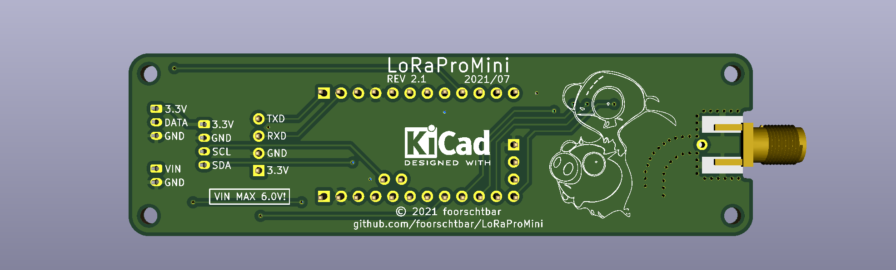

# LoRaProMini

:warning: This project is a WIP!

A LoRaWAN sensor node for The Things Network, based on an Arduino Pro Mini and RFM95W/SX1276 LoRa module. Uses a Bosch BME280 (humidity, barometric pressure and ambient temperature) sensor to measure inside the enclosure and a Maxim DS18B20(+)/DS18S20(+)/DS1822 1-Wire sensor to measure temperature outside the enclosure. The PCB is installed in a solar lamp and supplied with power from it. Between the data transmissions, the Arduino, LoRa module and all sensors go into deep sleep mode to save power.


<!---  --->

<!---  --->


## The Things Stack configuration

- LoRaWAN version `MAC V1.0.3`
- ...

## How to use

1. Flash config firmware (See [How to flash](#how-to-flash))
1. Start voltage calibration from menu
1. Set a voltage, measure the voltage with a multimeter and note the analog value. The range is optimized up to 5V
1. Use volts-per-bit calculator to get VBP factor for config
1. Create configuration with [Configuration Builder](https://foorschtbar.github.io/LoRaProMini/)
1. Write configuration to EEPROM using configuration menu
1. Check written configuration via configuration menu
1. Flash debug or release firmware (See [How to flash](#how-to-flash))
1. Finish

## How to flash

```
avrdude-F -v -c arduino -p atmega328p -P <COM PORT> -b 57600 -D -U flash:w:<FIRMWARE FILE>:i
```

Example:
```
avrdude -F -v -c arduino -p atmega328p -P COM4 -b 57600 -D -U flash:w:firmware_1.0_config.hex:i
```

## ToDo

- [x] Add CI/CD pipeline to build firmware
- [ ] Go to sleep immediately when voltage is too low
- [ ] Rewirte VBP calculator in Configuration Builder
- [x] Move config to EEPROM
- [x] Added special firmware to change configs
- [x] Build HTML/JS Interface to build configs
- [x] Add CRC32 check
- [x] Test ABP
- [x] Test OTAA
- [x] Deploy config tool via GitHub Pages
- [x] Fix problem when checksum in pastend config had zeros O.o
- [x] Add random EUI generator button to config tool
- [x] Parse config string to GUI fields

 
## TTN Payload decoder
```javascript
function decodeUplink(input) {
    var bytes = input.bytes;
    var temp1 = (bytes[0] & 0x80 ? 0xFFFF << 16 : 0) | bytes[0] << 8 | bytes[1];
    var humi1 = bytes[2] << 8 | bytes[3];
    var press1 = bytes[4] << 8 | bytes[5];
    var temp2 = (bytes[6] & 0x80 ? 0xFFFF << 16 : 0) | bytes[6] << 8 | bytes[7];
    var bat = bytes[8] << 8 | bytes[9];
    var fwversion = "0.0";
    if(bytes.length == 12) {
      fwversion = bytes[10] + "." + bytes[11];
    }
    return {
        data: {
            fwversion: fwversion,
            bme: {
                temperature: temp1 / 100,
                humidity: humi1 / 100,
                pressure: press1
            },
            ds18x: {
                temperature: temp2 / 100

            },
            battery: bat / 100
        },
        warnings: [],
        errors: []
    }
}
```
