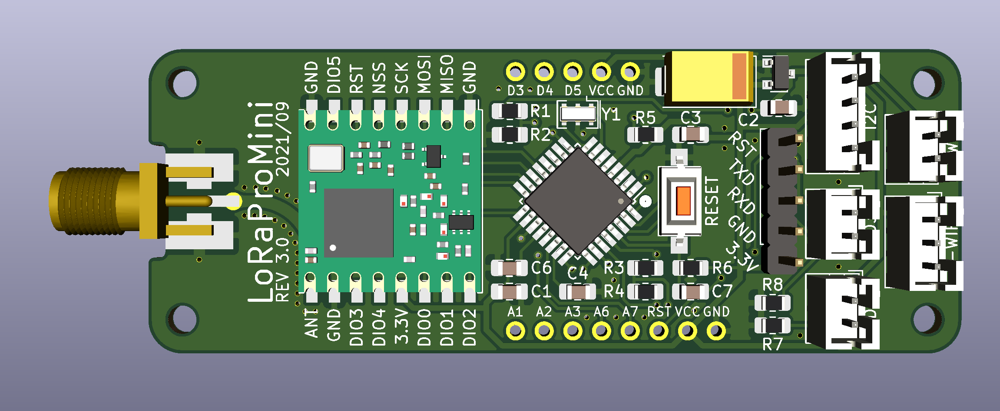
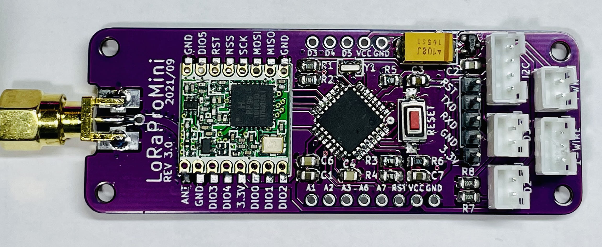
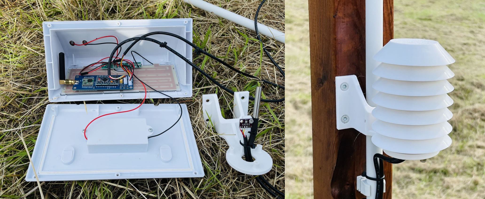
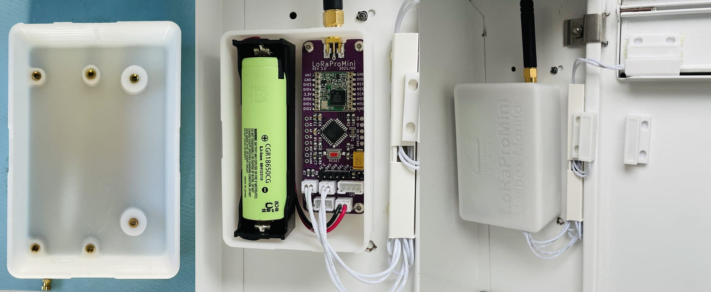
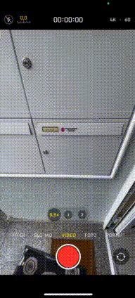
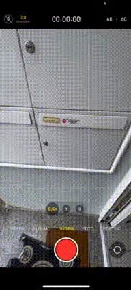
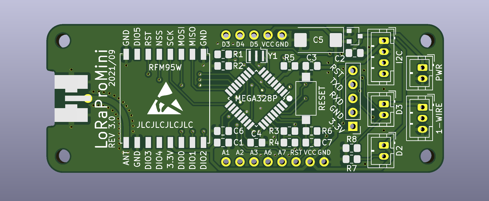
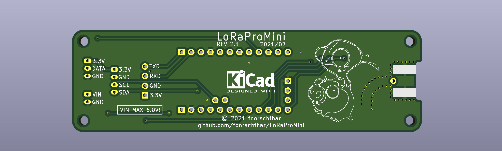
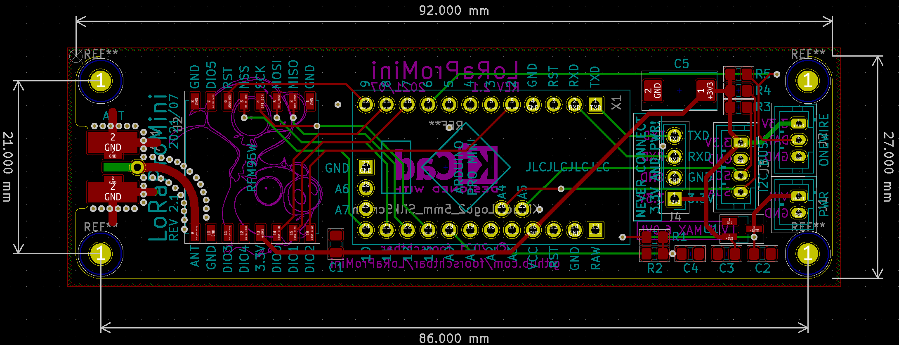

# LoRaProMini - A low power LoRaWAN Node

[


](https://github.com/foorschtbar/LoRaProMini)

A LoRaWAN sensor node, based on ATmega328P MCU (Arduino Pro Mini) and RFM95W/SX1276 LoRa Transceiver.




The module can be used:

- Collect various climate values with environmental sensors. See [Environmental (Weather/Clima) Sensor](#environmental-weatherclima-sensor)
- Tell if the letter carrier has put new letters in your mailbox. See [Mailbox Monitor](#mailbox-monitor)
- Notify if someone rang the doorbell
- Act a wirless button
- and many more...

## Features

- Deep sleep MCU and sensors between data transmissions
- Two interrupt inputs could use to wake up the MCU and sensors from deep sleep
- Confirmend und unconfirmend data up messages
- Ultra low power consumption. Under 10μA with all features and sensors
- Power input 3.5-6V:
  - Battery (Li-Ion or Li-SOCl2 works fine)
  - Battery with solar charger
- Sensor support
  - Bosch BME280 (humidity, barometric pressure and ambient temperature)
  - Maxim DS18B20(+)/DS18S20(+)/DS1822 1-Wire temperature sensor

## Example Applications

### Environmental (Weather/Clima) Sensor

 - Download [Radiation Shield STL](https://www.prusaprinters.org/prints/73421-radiation-shield-for-diy-weather-station)
 - Buy [Waterproof LED Solar Light](https://s.click.aliexpress.com/e/_9AKunB) 



### Mailbox Monitor

 - Download [Case STL](https://www.prusaprinters.org/prints/132941-case-for-lorawan-mailbox-monitor-lorapromini)
- Buy [Normal Close Reed Switches](https://s.click.aliexpress.com/e/_A1mmAd)



 

## More pics

<!---  --->



<!---  --->



## The Things Stack configuration

- LoRaWAN version `MAC V1.0.3`

## How to use

1. Manufacture the PCB. Here you find the [Gerber](pcb) files
1. Assemble the PCB. Here you find the [Bill of Materials](https://foorschtbar.github.io/LoRaProMini/pcb/bom/ibom.html) (BOM)
   - **Attention:** The current version (v3.1) of the PCB has no ISP header! A pre-burned Atmega328P must be installed. I got one from an Arduino Pro Mini Board (3.3V 8 Mhz), because a completely assembled Arduino is cheaper than a single chip
1. Flash config firmware (See [How to flash](#how-to-flash))
1. Start voltage calibration from menu
1. Start configuration builder [Configuration Builder](https://foorschtbar.github.io/LoRaProMini/configbuilder)
1. Measure the voltage with a multimeter
1. Insert multimeter voltage and the analog value in the Volts-per-bit (VPB) calculator to get VPB factor.
1. If u have a adjustable power supply, try different voltages to find best factor. Warning: The maximum voltage is 6 Volt
1. Fill out the other fields like activation methode, session keys and EUIs
1. Write configuration to EEPROM using configuration menu
1. Check written configuration via configuration menu
1. Flash debug or release firmware (See [How to flash](#how-to-flash))
1. Finish

## How to flash

```
avrdude-F -v -c arduino -p atmega328p -P <COM PORT> -b 57600 -D -U flash:w:<FIRMWARE FILE>:i
```

Example:

```
avrdude -F -v -c arduino -p atmega328p -P COM4 -b 57600 -D -U flash:w:firmware_1.0_config.hex:i
```

## Firmware Changelog

### Version 2.6

- Second attempt to solve the unnecessary delay due to the duty cycle limitation. Overflow of timer0 freezes the MCU after around 20 transmissions.

### Version 2.5

- Fixed problem with duty cycle limitation
- Fixed MCU deepsleep inaccuracy
### Version 2.4

- An external interrupt during a transmission terminates the transmission and starts a new transmission.
- Enabled Link Check Mode

### Version 2.3

- Fixed Typo

### Version 2.2

- An additional send delay between 0 and 20s has been added to avoid overlaps between different nodes with exactly the same send interval
- Some flash memory optimizations

### Version 2.1

- Improved (debug) logging to serial output
- BME sends -127°C (link DS18x) if no sensor was found

### Version 2.0

- Added wake up trough interrupt pins
- Added option for disable interrupt pins
- Added option for confirmed uplink
- Changed LoRaWAN data up message
  - Added state of interrupt pins
  - Combined major and minor version byte into a single byte (4 bits for major and 4 bits for minor)

### Version 1.1

- Only for testing CI Pipeline

### Version 1.0

- Initial Version

## PCB Changelog

### Version 3.1

- Added white field to specify the Node ID

### Version 3.0

- Removed Arduino Pro Mini Dauther PCB
- Added ATMEGA328P direct to the PCB
- Added pins for unused GPIOs
- Added D2 and D3 with Pulldowns and connector as external interrupts (need FW v2.0 or higher)

### Version 2.2

- Added RST pin to connector for programming

### Version 2.1

- Added connector for programming

### Version 2.0

- Smaller PCB
- Rounded Edges
- Fixed issue with DS18x onboard pin mapping

### Version 1.0

- Initial PCB

## TTS Payload Formatter (formerly TTN Payload Decoder)

```javascript
function decodeUplink(input) {
  var bytes = input.bytes;

  var itrTrigger = (bytes[0] & 0x1) !== 0; // Message was triggerd from interrupt (bit 0)
  var itr0 = (bytes[0] & 0x2) !== 0; // Interrupt 0 (bit 1)
  var itr1 = (bytes[0] & 0x4) !== 0; // Interrupt 1 (bit 2)
  var bat = (bytes[1] << 8) | bytes[2]; // Battery
  var fwversion = (bytes[3] >> 4) + "." + (bytes[3] & 0xf); // Firmware version
  var temp1 = (bytes[4] & 0x80 ? 0xffff << 16 : 0) | (bytes[4] << 8) | bytes[5]; // BME Temperature
  var humi1 = (bytes[6] << 8) | bytes[7]; // BME Humidity
  var press1 = (bytes[8] << 8) | bytes[9]; // BME Pressure
  var temp2 =
    (bytes[10] & 0x80 ? 0xffff << 16 : 0) | (bytes[10] << 8) | bytes[11]; // DS18x Temperature

  var mbStatus = "UNKOWN";
  if (itr0) {
    mbStatus = "FULL";
  } else if (itr1) {
    mbStatus = "EMPTY";
  }

  return {
    data: {
      interrupts: {
        itr0: itr0,
        itr1: itr1,
        itrTrigger: itrTrigger,
      },
      extra: {
        mbStatus: mbStatus,
        mbChanged: itrTrigger,
      },
      fwversion: fwversion,
      bme: {
        temperature: temp1 / 100,
        humidity: humi1 / 100,
        pressure: press1,
      },
      ds18x: {
        temperature: temp2 / 100,
      },
      battery: bat / 100,
    },
    warnings: [],
    errors: [],
  };
}
```

## ToDo

- [ ] Go to sleep immediately when voltage is too low
- [ ] Multi point calibration for battery voltage
- [ ] Set ADR (On/Off)
- [ ] Set SF (7-12)
- [x] Add wake up trough interrupt pins
- [x] Move Major- and Minorversion byte to single byte. 4 bits for major and 4 bits for minor.
- [x] Add option for Confirmed Uplink to config
- [x] Add CI/CD pipeline to build firmware
- [x] Rewirte VBP calculator in Configuration Builder
- [x] Move config to EEPROM
- [x] Added special firmware to change configs
- [x] Build HTML/JS Interface to build configs
- [x] Add CRC32 check
- [x] Test ABP
- [x] Test OTAA
- [x] Deploy config tool via GitHub Pages
- [x] Fix problem when checksum in pastend config had zeros O.o
- [x] Add random EUI generator button to config tool
- [x] Parse config string to GUI fields
